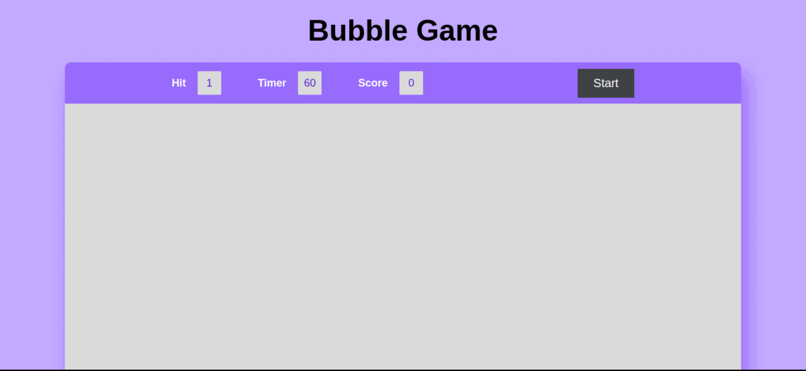

# Bubble Game

Welcome to the Bubble Game! This simple web-based game allows you to test your reflexes and aim by popping bubbles that appear on the screen.

## Table of Contents

- [Demo](#demo)
- [Getting Started](#getting-started)
- [Gameplay](#gameplay)
- [Technologies Used](#technologies-used)
- [Contributing](#contributing)
- [License](#license)

## Demo

Before diving into the game, you can check out a live demo [here](#your-demo-link).



## Getting Started

Follow these steps to set up the Bubble Game on your local machine:

1. Clone the repository to your local system:

   ```bash
   git clone https://github.com/ravin972/Bubble_Game.git
   ```

2. Navigate to the project directory:

   ```bash
   cd Bubble_Game
   ```

3. Open the `index.html` file in your preferred web browser to play the game.

## Gameplay

The objective of the Bubble Game is simple: pop as many bubbles as you can within the time limit. Here's how to play:

1. Click the "Start" button to begin the game.
2. Bubbles will appear on the screen randomly.
3. Click on a bubble to pop it and earn points.
4. You have a limited time (60 seconds) to score as many points as possible.
5. The hit count, timer, and score are displayed at the top of the screen.

## Tech Stack Used

This project was created using the following technologies:

- HTML
- CSS
- JavaScript

## Contributing

If you'd like to contribute to the Bubble Game project, please follow these steps:

1. Fork the repository.

2. Create a new branch for your feature or bug fix:

   ```bash
   git checkout -b feature/your-feature-name
   ```

3. Make your changes and commit them:

   ```bash
   git commit -m "Add your feature or fix"
   ```

4. Push your changes to your fork:

   ```bash
   git push origin feature/your-feature-name
   ```

5. Open a pull request on the original repository.

6. Your contribution will be reviewed, and once approved, it will be merged into the main branch.

## License

This project is licensed under the MIT License - see the [LICENSE](LICENSE) file for details.

Enjoy playing the Bubble Game! If you have any questions or encounter any issues, feel free to open an issue in the repository. Happy gaming!
